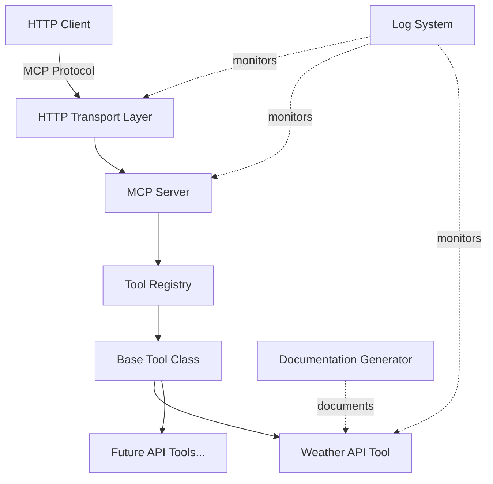

# Design Document

## Overview

The MCP API Converter is a TypeScript application that provides a framework for converting REST APIs into Model Context Protocol (MCP) tools. The system uses an extensible class-based architecture where each API implementation extends a base class to automatically integrate with the MCP server. The application includes HTTP transport for remote access, multi-level logging for debugging, and automatic documentation generation.

## Architecture

### High-Level Architecture



### Component Layers

1. **Transport Layer**: HTTP server handling MCP protocol messages
2. **MCP Server Layer**: Core MCP server managing tool registration and execution
3. **Tool Framework Layer**: Base class and registry for API tools
4. **Implementation Layer**: Concrete API tool implementations (Weather API, etc.)
5. **Cross-Cutting Concerns**: Logging system and documentation generator

## Components and Interfaces

### 1. Base Tool Class

**Purpose**: Abstract base class that all API implementations extend

**Interface**:
```typescript
abstract class BaseTool {
  abstract name: string;
  abstract description: string;
  abstract inputSchema: object;
  
  abstract execute(params: any): Promise<any>;
  
  // Provided by base class
  register(server: MCPServer): void;
  validate(params: any): boolean;
  getToolDefinition(): ToolDefinition;
}
```

**Responsibilities**:
- Define the contract for all API tools
- Provide common validation logic
- Handle MCP tool registration
- Format tool definitions for MCP protocol

### 2. MCP Server

**Purpose**: Core server managing tool lifecycle and execution

**Interface**:
```typescript
class MCPServer {
  private tools: Map<string, BaseTool>;
  private httpTransport: HTTPTransport;
  
  registerTool(tool: BaseTool): void;
  listTools(): ToolDefinition[];
  executeTool(name: string, params: any): Promise<any>;
  start(port: number): Promise<void>;
}
```

**Responsibilities**:
- Maintain registry of available tools
- Handle tool discovery and listing
- Route execution requests to appropriate tools
- Manage HTTP transport lifecycle

### 3. HTTP Transport

**Purpose**: Expose MCP server via HTTP protocol

**Interface**:
```typescript
class HTTPTransport {
  private server: http.Server;
  private mcpServer: MCPServer;
  
  start(port: number): Promise<void>;
  handleRequest(req: Request, res: Response): Promise<void>;
  stop(): Promise<void>;
}
```

**Responsibilities**:
- Create HTTP server listening on specified port
- Parse incoming MCP protocol messages
- Serialize responses to MCP protocol format
- Handle connection lifecycle

### 4. Log System

**Purpose**: Multi-level logging for debugging and monitoring

**Interface**:
```typescript
enum LogLevel {
  INFO = 'info',
  DEBUG = 'debug',
  WARNING = 'warning',
  ERROR = 'error'
}

class Logger {
  static info(message: string, context?: object): void;
  static debug(message: string, context?: object): void;
  static warning(message: string, context?: object): void;
  static error(message: string, error?: Error, context?: object): void;
  
  static setLevel(level: LogLevel): void;
}
```

**Log Format**:
```
[2024-11-16T10:30:45.123Z] [INFO] MCP Server started on port 3000
[2024-11-16T10:30:46.456Z] [DEBUG] Tool registered: weather-api
[2024-11-16T10:31:00.789Z] [ERROR] Weather API request failed: Network timeout
```

**Responsibilities**:
- Provide consistent logging interface across all components
- Include timestamps and context in all log entries
- Support filtering by log level
- Capture stack traces for errors

### 5. Weather API Tool

**Purpose**: First concrete implementation demonstrating the framework

**Interface**:
```typescript
class WeatherAPITool extends BaseTool {
  name = 'get-weather';
  description = 'Get current weather for a location';
  inputSchema = {
    type: 'object',
    properties: {
      location: { type: 'string', description: 'City name or coordinates' }
    },
    required: ['location']
  };
  
  async execute(params: { location: string }): Promise<WeatherResponse>;
}
```

**External API**: OpenWeatherMap API (free tier) or WeatherAPI.com

**Responsibilities**:
- Validate location parameter
- Make HTTP request to weather API
- Transform response to consistent format
- Handle API errors gracefully

### 6. Documentation Generator

**Purpose**: Automatically create task documentation

**Interface**:
```typescript
class DocumentationGenerator {
  static createTaskDoc(taskName: string, content: TaskDocContent): void;
  static getDocsPath(): string;
}

interface TaskDocContent {
  objective: string;
  implementation: string;
  files: string[];
  notes?: string;
}
```

**Responsibilities**:
- Create docs folder if not exists
- Generate markdown files with consistent naming
- Include task metadata and implementation details
- Organize documentation chronologically

## Data Models

### Tool Definition
```typescript
interface ToolDefinition {
  name: string;
  description: string;
  inputSchema: {
    type: 'object';
    properties: Record<string, SchemaProperty>;
    required?: string[];
  };
}
```

### Weather Response
```typescript
interface WeatherResponse {
  location: string;
  temperature: number;
  temperatureUnit: 'celsius' | 'fahrenheit';
  conditions: string;
  humidity?: number;
  windSpeed?: number;
  timestamp: string;
}
```

### MCP Protocol Messages
```typescript
interface MCPRequest {
  method: 'tools/list' | 'tools/call';
  params?: {
    name?: string;
    arguments?: any;
  };
}

interface MCPResponse {
  result?: any;
  error?: {
    code: number;
    message: string;
  };
}
```

## Error Handling

### Error Categories

1. **Validation Errors**: Invalid parameters provided to tools
   - Return error response with clear validation message
   - Log at WARNING level

2. **External API Errors**: Weather API or other external services fail
   - Retry once with exponential backoff
   - Return user-friendly error message
   - Log at ERROR level with full details

3. **Server Errors**: HTTP transport or MCP server issues
   - Log at ERROR level with stack trace
   - Return 500 status code with generic message
   - Ensure server remains running

4. **Tool Registration Errors**: Invalid tool implementations
   - Throw error during startup
   - Log at ERROR level
   - Prevent server from starting

### Error Response Format
```typescript
interface ErrorResponse {
  error: {
    code: string;
    message: string;
    details?: any;
  };
}
```

## Testing Strategy

### Unit Tests
- Test BaseTool validation logic
- Test Logger formatting and level filtering
- Test WeatherAPITool parameter validation
- Mock external API calls

### Integration Tests
- Test tool registration with MCP server
- Test HTTP transport with real MCP protocol messages
- Test end-to-end weather query flow
- Verify logging captures all operations

### Manual Testing
- Start server and verify HTTP endpoint
- Connect with MCP client and list tools
- Execute weather tool with various locations
- Review logs for completeness
- Verify documentation generation

## Project Structure

```
mcp-api-converter/
├── src/
│   ├── core/
│   │   ├── BaseTool.ts
│   │   ├── MCPServer.ts
│   │   └── HTTPTransport.ts
│   ├── tools/
│   │   └── WeatherAPITool.ts
│   ├── utils/
│   │   ├── Logger.ts
│   │   └── DocumentationGenerator.ts
│   ├── types/
│   │   └── index.ts
│   └── index.ts
├── docs/
│   └── (generated task documentation)
├── tests/
│   ├── unit/
│   └── integration/
├── package.json
├── tsconfig.json
└── README.md
```

## Configuration

### Environment Variables
- `PORT`: HTTP server port (default: 3000)
- `LOG_LEVEL`: Logging verbosity (default: info)
- `WEATHER_API_KEY`: API key for weather service
- `WEATHER_API_URL`: Base URL for weather API

### TypeScript Configuration
- Target: ES2020
- Module: CommonJS
- Strict mode enabled
- Source maps for debugging
- Output directory: dist/

## Dependencies

### Runtime Dependencies
- `@modelcontextprotocol/sdk`: MCP protocol implementation
- `express` or native `http`: HTTP server
- `axios`: HTTP client for external APIs
- `zod`: Runtime schema validation

### Development Dependencies
- `typescript`: TypeScript compiler
- `@types/node`: Node.js type definitions
- `ts-node`: TypeScript execution
- `jest`: Testing framework
- `@types/jest`: Jest type definitions
